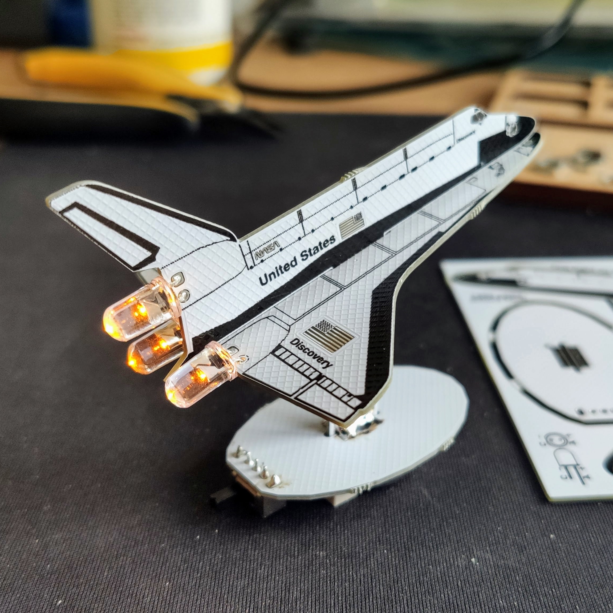

# Space Shuttle Discovery
This small kit card style solder kit uses a CR2032 coin cell battery to power 3 candle-style flickering LEDs.

## Assembly instructions
- carefully depanelize the PCB by bending it
- optionally file or sand the rough edges
- pay attention to the orientation of the battery holder and the LEDs
- carefully bend the LED leads and solder them in place before assembling the plane
- slide the wings over the leg of the body
- pay attention to the polarity marks on the plane body and the baseplate
- solder the mechanical joints on one side first. This will allow you to make easy corrections when it's not perfectly perpendicular

## REV 00
First prototype to verify the mechanical design.

## REV 01
Updated the mechanical design.